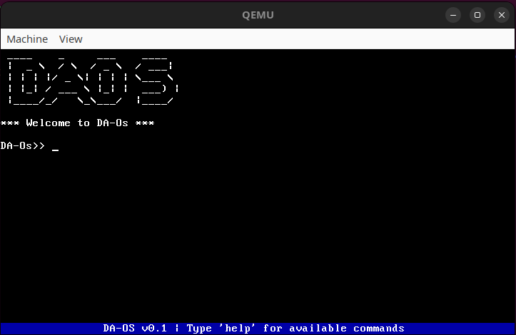
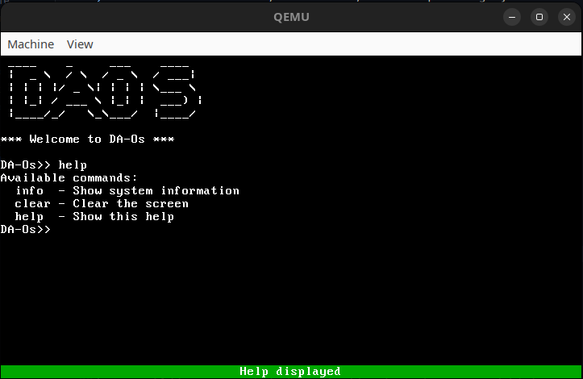
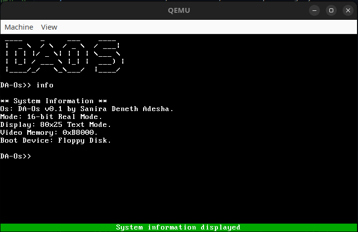

<h1 align="center">🧠 DA-Os</h1>
<h3 align="center">A Minimalist 16-bit Operating System Built from Scratch</h3>

<p align="center">
  
  
  
</p>

---

### 🚀 Project Overview

> **DA-Os** is a simple, text-based, 16-bit operating system built for x86 architecture in **real mode**. It’s an educational project developed from scratch to understand the core principles of OS development — from bootloading to building a basic shell.

---

### 🖼️ Screenshots

<p align="center">
  <br>
  
  
</p>

---

### 🔧 Core Features

- 🧬 **Custom 16-bit Bootloader** (`boot.asm`)
- 🧠 **C-based Kernel Logic** (`kernel.c`)
- 💬 **Command-Line Interface (CLI)**
- ⚙️ **Built-in Commands**: `help`, `info`, `clear`
- 🖥️ **Direct VGA Text Mode Manipulation**
- 🔁 **Automatic Screen Scrolling**
- ⌨️ **Keyboard Input with Scancode Handling**

---

### 🌟 Special Features

#### 🧭 Dynamic Status Bar
- **Color-Coded Feedback**:
  - 🔵 Blue: Idle state
  - ✅ Green: Command successful
  - ❌ Red: Invalid command
- **Contextual Messages** like “Help displayed” or “Unknown command”

#### 🔂 Command History
- ⬆️⬇️ Use **Arrow Keys** to navigate through your last 10 commands
- 🔁 **Re-execute** previous commands with a single press

---

### 🏗️ Architecture

#### 🔹 Bootloader (`boot.asm`)
- Loaded at `0x7C00` by BIOS
- Loads 10 sectors into `0x7E00` using interrupt `0x13`
- Sets up the stack, segment registers, and jumps to the kernel

#### 🔹 Kernel (`kernel.c`)
- Starts at `kernel_main`
- Displays the welcome banner and enters an input loop
- Handles command parsing, screen output, and status bar updates

---

### 📁 Project Structure

```bash
.
├── boot.asm        # Assembly bootloader
├── kernel.c        # Main C kernel code
├── link.ld         # Linker script
├── Makefile        # Build automation
├── Screenshots/    # Screenshots for README
└── README.md       # This file
```
---

### ⚙️ How to Build and Run

#### 🔹 🔧 Prerequisites
- nasm
- i686-elf-gcc
- ld
- QEMU

#### 🔹 🛠️ Build Steps
```bash
make        # Builds the bootloader and kernel, creates os.img
make run    # Launches DA-Os in QEMU
```
💡 All steps are automated via the Makefile.

---

### 🧑‍💻 Built By
<h4 align="center">Hi 👋, I'm Sanira</h4> <p align="center">💻 A Full-Stack Developer 🇱🇰 Sri Lanka</p>
💬 Always open to collaborations and tech discussions!

---

### 📬 Connect with Me
<p align="left"> <a href="https://www.linkedin.com/in/sanira-deneth-615013320/" target="_blank">  </a> <a href="mailto:sanira.adesha@gmail.com" target="_blank">  </a> </p>

---

<p align="center">⚡ _Learning how real systems work from the ground up!_</p> 

